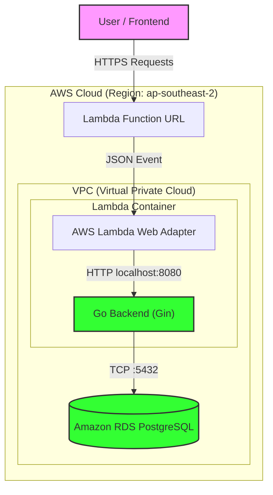

# ThreadTalk Backend API

> A high-performance, serverless forum backend built with Go and PostgreSQL.

**ThreadTalk** is a scalable REST API providing user authentication, threaded discussions, and pagination. It is engineered to run as a serverless container on AWS Lambda, utilizing the AWS Lambda Web Adapter for seamless portability between local development and cloud execution.

## 🚀 Key Features
* **Authentication:** JWT-based stateless auth (Signup/Login).
* **Forum Core:** Topics, Posts, and nested Comments.
* **Architecture:** Serverless (Scale-to-Zero) with AWS Lambda.
* **Security:** Production-grade VPC isolation and BCrypt password hashing.
* **DevOps:** Automated CI/CD pipeline via GitHub Actions.

## 🛠 Tech Stack
* **Language:** Go (Gin Framework)
* **Database:** PostgreSQL 15 (AWS RDS)
* **Infrastructure:** AWS Lambda (Docker Image), ECR, CloudWatch
* **Tooling:** Docker, GitHub Actions, `golang-migrate`

## 🏗 Cloud Architecture



## ⚡ Getting Started (Local Development)

Follow these steps to run the backend and database on your own machine.

### Prerequisites
* **Docker Desktop** (Running)
* **Go 1.23+** (Optional, if running outside Docker)

### Step 1: Clone the Repository
```bash
git clone [https://github.com/v1-nce/threadtalk-backend.git](https://github.com/v1-nce/threadtalk-backend.git)
cd threadtalk-backend
```

### Step 2: Configure Environment
Create a `.env` file in the root directory:
```bash
# .env
DB_HOST=db
DB_USER=postgres
DB_PASSWORD=postgres
DB_NAME=threadtalk
DB_PORT=5432
PORT=8080
FRONTEND_URL=
BACKEND_URL=
```

### Step 3: Start Services
Run the entire stack (Go Backend + Postgres Database) with one command:
```bash
docker-compose up --build
```

### Step 4: Verify
* **API:** Accessible at `http://localhost:8080`
* **Database:** Accessible on port `5432`

To stop the services, press `Ctrl+C` or run:
```bash
docker-compose down
```